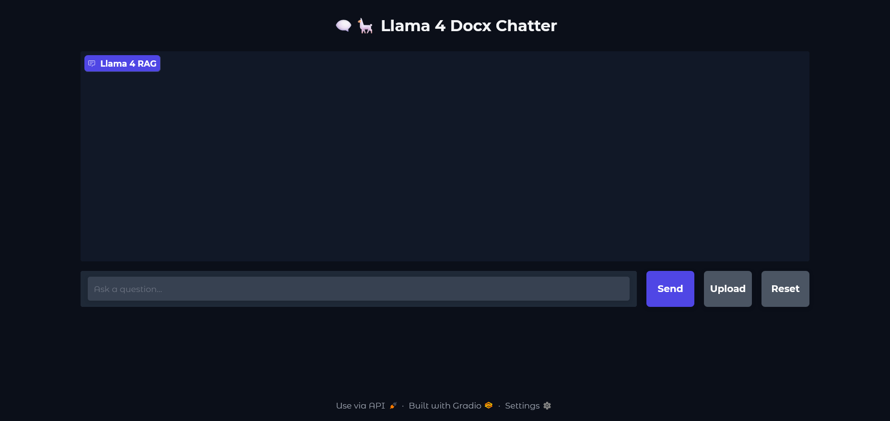

 Building a RAG pipeline using the LangChain ecosystem and a web application that allows users to:
 

   - Upload documents (currently only DOCX is supported)

   - Ask questions about their content

   - Get accurate responses using Llama 4 + RAG

   🔧 Technologies Used

    Llama 4

    - LangChain

    - Vector Stores(Chroma DB)

    - Gradio for the web interface

💡 Coming Soon

-Support for multiple document types

-User authentication

    Preview 
